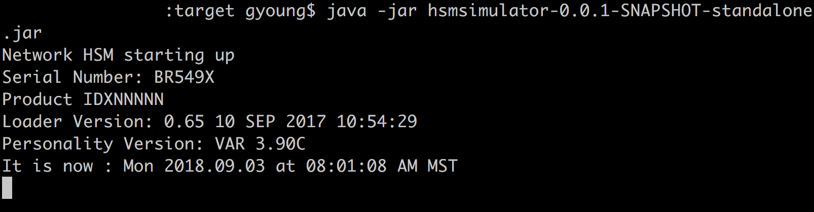
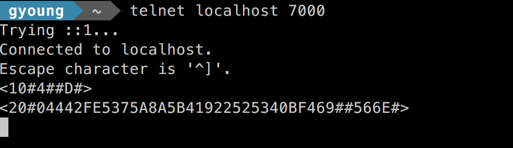

## HSM Simulator

Snyk.io status
[](https://snyk.io/test/github/gjyoung1974/hsm-simulator?targetFile=pom.xml)

Build status
[](https://circleci.com/gh/gjyoung1974/hsm-simulator)

Supports variant key management only - no other key management modes yet.

Is a Java process that simulates a financial services Hardware Security Module (HSM). 
A class called `ServerProcess` starts a plain-text TCP service to simulate an HSM Request/Response transaction. 
config.properties contains runtime settings and master keys

Sample usage:
```bash
build:
$ mvn clean package

Start the HSM Simulator as follows:
from a command prompt:

$ Java -cp ./target/hsmsimulator-0.0.1-SNAPSHOT-standalone.jar com.goyoung.crypto.hsmsim.ServerProcess
```    
    
    
```   
1. User telnets to IP specified in the properties file 
$ telnet localhost 8080
2. User sends a command 10: <10#4##D#>  // request to generate double length key for 2TDEA TripleDES
3. User receives command 10 response (20): <20#F6DFEAAD648A7A17E5A9CE0796440D9D##63E0#>   
// response of double length key for 2TDEA 3DES  //key is not encrypted by any master key, 
//response contains a 4 char Key Check Value, KCV at the end

4. User Sends command 10			   : <10#1#9007B8751BB7AB4EE355AF51A716113F#D#>    
// generate double length key for 2TDEA 3DES, encrypt under variant 1 of the MFK and variant 1 or KEK, 
//Provided KEK previously encrypted under variant 0 of MFK
5. User receives command 10 response (20): <20#6CEDF649AAA492B90F909AD3A6D2D54F#64B343D9C5AB8C8692122EFDA11D62F6#07CB#>
// double length key for 2TDEA 3DES encrypted by MFK.variant.1 (leftmost
and KEK.variant.1 with char Key Check Value (rightmost), and KCV at the right end     

Example:    
```    
     


Let's generate a key:     
```bash
$ telnet localhost 8080
Trying ::1...
Connected to localhost.
Escape character is '^]'.
<10#4##D#>
<20#D3E07B0C441E1F9E52CB063D3592F05B##DD1B#>
```
---

Included libraries: see the project file for libraries required to build the project:     
   
